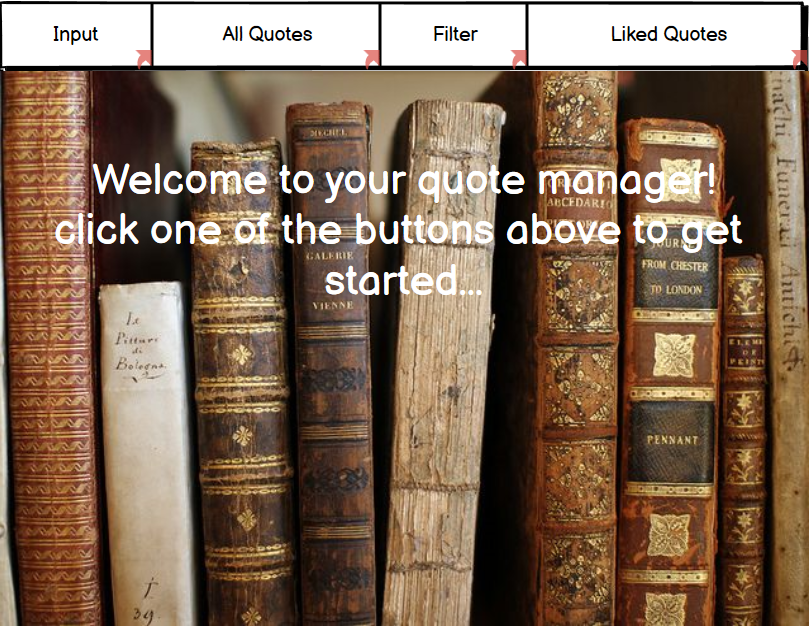
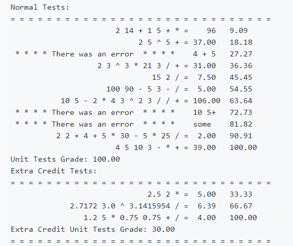
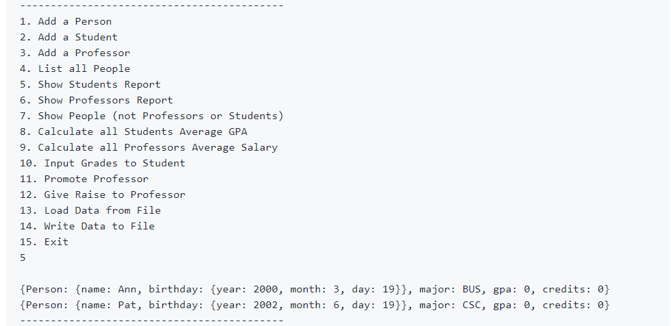
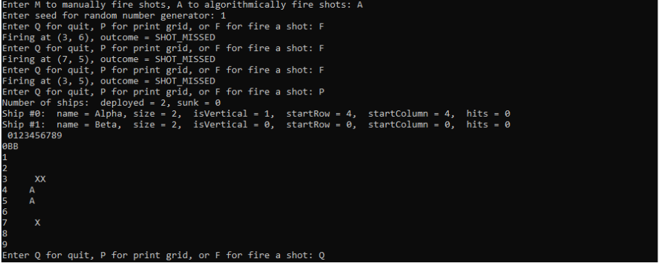

## Portfolio
### Projects
#### [Quote Manager Application GUI](https://github.com/Alison003/Alison003.github.io/blob/051ad343e4fb87761be62feea9ed10495e5e9f98/docs/UI%20with%20navigation.bmpr) (Spring 2021)
Course: Applications Programming 
- Used Balsamiq wireframes to design a mobile application 
- This is a quote manager mobile application to store and categorize quotes from the user

#### [Encoding Text Files using Huffman Trees](https://github.com/csc2431-spring2020/huffman-Alison003) (June 2020)
Course: Data Structures 2
- Written in C++
- This code takes a file as input and creates a Huffman Tree based on the frequency of each character found in the file
- Uses binary tree and tree searching concepts

#### [Evaluating Postfix Operations](https://github.com/csc2431-spring2020/postfix-eval-Alison003) (May 2020)
Course: Data Structures 2
- Written in C++
- This code evaluates postfix operations 
- Uses stack and queue concepts

#### [Inheritance Project](https://github.com/csc2431-spring2020/inheritance-Alison003) (May 2020)
Course: Data Structures 2
- Written in C++
- This code handles operations within a person-student-professor class
- Uses inheritance and polymorphism concepts 

#### [Battleship Game](https://github.com/csc2430-winter-2020/battleship-version-2-0-Alison003) (February 2020)
Course: Data Structures 1
- Written in C++
- This code produces a simple Battleship game between the user and a CPU opponent
- Uses C++ class implementation concepts

